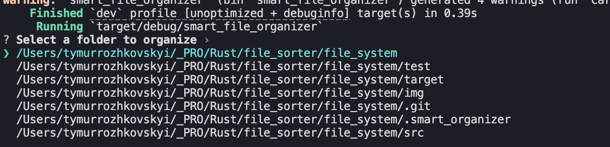
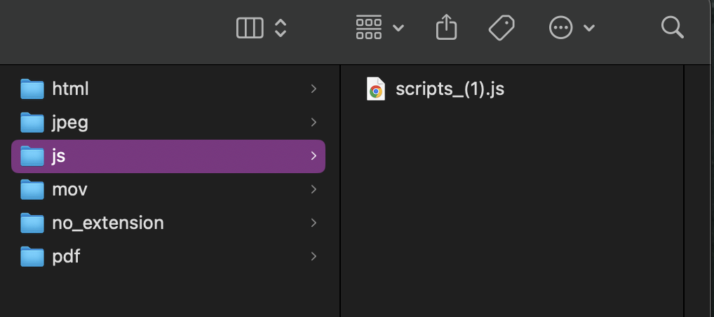
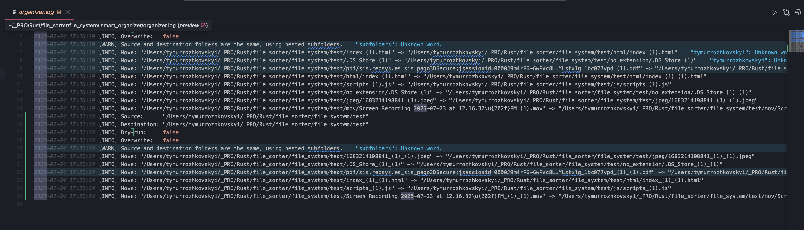
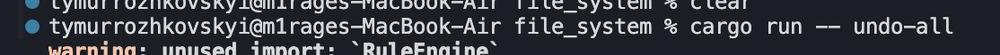
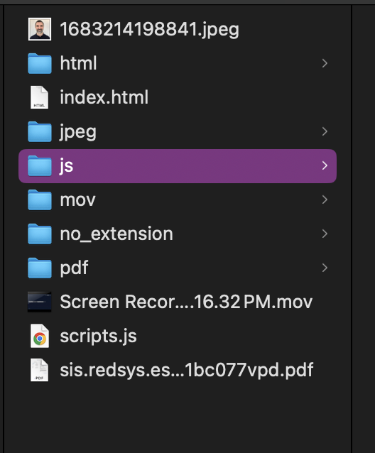
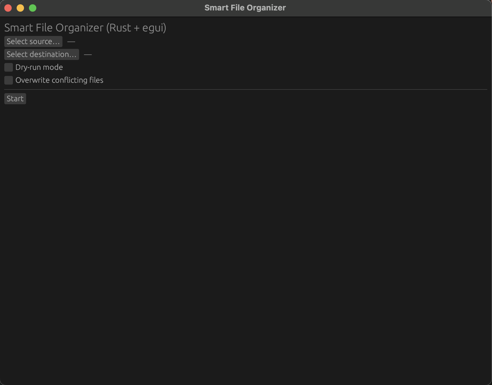
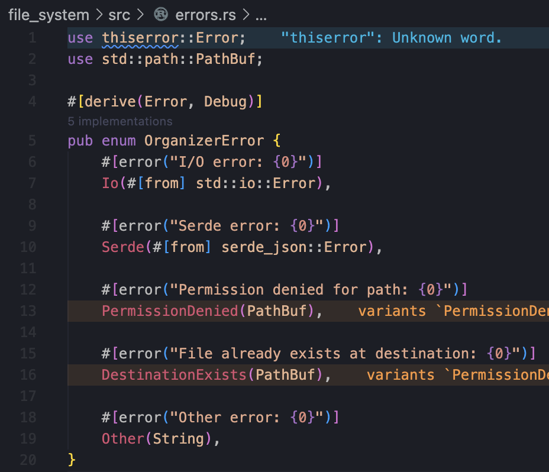

# Smart File Organizer

This project is a file organizer written in Rust. It goes through a folder and moves all files into subfolders based on their file type (like `.jpg`, `.pdf`, etc.).

## Main Goal
Automatically organize messy folders.

## Supported Usage Modes
- Through the terminal (CLI)
- Through a simple graphical window (GUI)

## What the Project Does
- Goes through all files in the selected folder
- Detects each file's extension (like `.jpg`, `.pdf`)
- Moves each file into a subfolder named after its type  
  Example: `.jpg` files go into `Images/`, `.pdf` go into `PDFs/`
- Optionally allows custom sorting rules defined in a `.json` file
- If a destination folder already has a file with the same name:
  - It renames the file (e.g. `file(1).jpg`)
  - Or overwrites it, if allowed
- Every move is saved into a history file to support undo
  - Undo the last move or all moves
- Logs every move with time and file paths
- Supports a "dry run" mode to preview changes without moving anything

## Why This Matches the Assignment
- ✅ Scans a folder and reads file paths  
- ✅ Classifies files by extension or rule  
- ✅ Creates folders and moves files  
- ✅ Logs source, destination, and time  
- ✅ Menu to choose folder (CLI and GUI)  
- ✅ Undo support via history file  
- ✅ GUI built with `egui` (Rust alternative to `tkinter`)  
- ✅ Handles name conflicts and errors  
- ✅ Finalized with a clear README and testing  
- ✅ OOP paradigm  

## How to Use It (CLI)

1. Open terminal  
2. Go to the project folder  
3. Run:

```bash
cargo run
```

Add `--dry-run` to preview actions without moving files
Example: `cargo run -- organize --src ./your_folder --dry-run`

Add `--overwrite` to allow file replacement

Add `--rules rules.json` to use custom sorting logic

Use `cargo run -- undo-all` to revert all file moves using history

## How to Use It (GUI)
Run: `cargo run -- --gui`

A window will open

Click “Choose folder”

Click “Start”

Files will be organized into subfolders

## Images / Tasks

**Task:** Understand how file paths work. Scan files in a folder.  
**Task:** Classify files by extension (.jpg, .pdf, etc.)  
**Task:** Create destination folders and move files  



---

**Task:** Add logging of moved files (source, destination, time)  


**Task:** Add menu to let the user choose which folder to organize  


**Task:** Add undo function by keeping a “moved files” history  



**Task:** Add a GUI using egui (tkinter analog for Rust)


**Task:** Add error handling (conflicting names, permission issues)  

